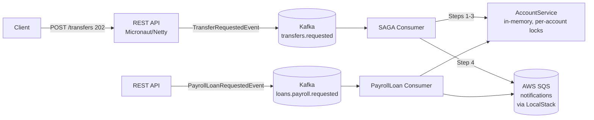
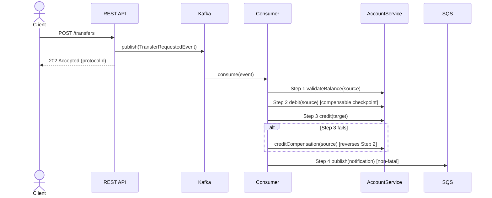
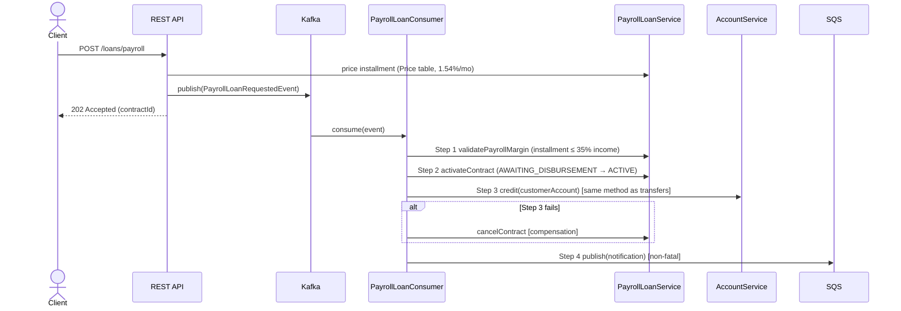

# Architecture — Banking SAGA POC

This document condenses the architectural reference of the project: the SAGA
choreography for bank transfers, the payroll loan SAGA built on top of the same
building blocks, and the reasoning behind the main decisions. The README covers
how to run and test everything; this page focuses on *why the system looks the
way it does*.

## 1. Big picture



Two products share one runtime:

- **Transfers** — hexagonal module (`transfer/`): domain + use cases behind
  ports, with web/Kafka/SQS adapters at the edges.
- **Payroll loan** — a second choreographed SAGA that reuses the same
  `AccountService.credit` for disbursement and the same SQS publisher for
  notifications.

## 2. Transfer SAGA (choreography)



State machine (`SagaState`):

```
STARTED → VALIDATING → DEBIT_COMPLETED → CREDIT_COMPLETED → COMPLETED
                     ↘ COMPENSATING → DEBIT_REVERTED → CANCELED
```

Failure semantics:

| Failure point | Outcome |
|---------------|---------|
| Step 1 (balance) | SAGA CANCELED, no account touched |
| Step 2 (debit) | SAGA CANCELED, no account touched |
| Step 3 (credit) | Compensation reverses the debit → CANCELED |
| Compensation itself | FAILED — manual intervention, record preserved |
| Step 4 (SQS) | Transfer stays COMPLETED; failure logged (DLQ retry in production) |

## 3. Payroll loan SAGA

Same choreography, different "origin of funds": the disbursed money comes from
the bank's own capital, so there is no Step-2 debit of a customer account.



**Installment collection never debits the checking account.** A scheduler
(`processMonthlyDeductions`, interval `payroll-loan.deduction.interval`,
default 30s — compressed for the demo) applies Price amortization to the
outstanding balance: the period's interest accrues *before* the fixed
installment is subtracted, so the contract pays off exactly at `termMonths`.
The deduction models a payroll/benefit discount that happens before the money
would ever reach the account.

Contract state machine (`ContractStatus`):

```
AWAITING_DISBURSEMENT → ACTIVE → (monthly deductions) → PAID_OFF
AWAITING_DISBURSEMENT → CANCELED   (margin exceeded or credit failure)
```

## 4. Reliability choices

- **Producer**: `acks=all` + idempotent producer → exactly-once publish.
- **Consumer**: `enable.auto.commit=false` → the offset only advances after all
  steps ran (at-least-once processing); `sagaId` keyed partitioning preserves
  per-SAGA ordering.
- **Idempotency**: `sagaId` (prefix `SAGA-`) correlates and de-duplicates steps;
  `protocolId` (`TRF-`/`LOAN-`) is the client-facing trace ID.
- **Concurrency**: one `ReentrantReadWriteLock` per account — two transfers
  hitting the same account serialize on the write lock, simulating per-row DB
  locking.

## 5. Deliberate POC simplifications

| Simplification | Production replacement |
|----------------|------------------------|
| In-memory balances/contracts | PostgreSQL with `SELECT ... FOR UPDATE`, or NoSQL with optimistic locking |
| SQS failure only logged | Dead-letter queue + retry policy (a DLQ is already provisioned in LocalStack) |
| 30s deduction scheduler | Monthly job aligned with the payroll/benefit payment date |
| Single app instance | Consumer group scaling — partitions already set to 3 |
| Stateful test singletons | Isolated persistence per test (order sensitivity is a known limitation) |

## 6. Known issue

Bean-validation failures (`@Valid` rejecting a request body) on both
`/transfers` and `/loans/payroll` return `500` instead of `400`: the default
error-body serialization recurses ("Document nesting depth exceeds the maximum
allowed") in this micronaut-serde-jackson/validation version combination. The
tests therefore accept `400/422` where applicable and the fix would be a custom
`ExceptionHandler` for `ConstraintViolationException`.
